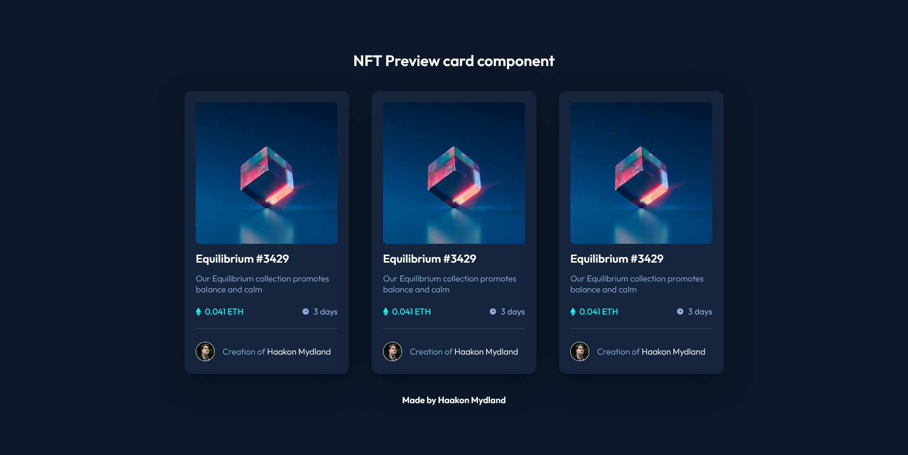

# Frontend Mentor - NFT preview card component solution

This is a solution to the [NFT preview card component challenge on Frontend Mentor](https://www.frontendmentor.io/challenges/nft-preview-card-component-SbdUL_w0U).

## Table of contents

- [Overview](#overview)
  - [The challenge](#the-challenge)
  - [Screenshot](#screenshot)
  - [Links](#links)
- [My process](#my-process)
  - [Built with](#built-with)
  - [What I learned](#what-i-learned)
- [Author](#author)

## Overview

### The challenge

- Re-create design in code

Users should be able to:

- View the optimal layout depending on their device's screen size
- See hover states for interactive elements

### Screenshot



### Links

- Solution URL: [Add solution URL here](https://your-solution-url.com)

## My process

### Built with

- [React](https://reactjs.org/) - JS library
- CSS custom properties
- Flexbox
- Mobile-first workflow

### What I learned

This was a great way to update my react knowledge. It's a pretty simple project and probably wouldn't be a big deal to code up for myself normaly. However using this as a opportunity to work on my react skills was a fun and educational.

I created the whole project as a react component so that it could easily be used and scaled

```jsx
<Card
  image={image}
  title="Equilibrium #3429"
  href="https://github.com/haakonmydland"
  text="Our Equilibrium collection promotes balance and calm"
  price="0.041"
  time="3 days"
  creator={{
    name: "Haakon Mydland",
    img: creatorImage,
    href: "https://github.com/haakonmydland",
  }}
/>
```

I'm also quite happy with turning the svgs into jsx so it could easily be added as a component

```jsx
const IconEth = () => {
  return (
    <svg width="11" height="18" xmlns="http://www.w3.org/2000/svg">
      <path
        d="M11 10.216 5.5 18 0 10.216l5.5 3.263 5.5-3.262ZM5.5 0l5.496 9.169L5.5 12.43 0 9.17 5.5 0Z"
        fill="#00FFF8"
      />
    </svg>
  );
};
export default IconEth;
```

## Author

- Website - [Haakon Mydland](https://www.haakonmydland.com/home)
- Frontend Mentor - [@haakonmydland](https://www.frontendmentor.io/profile/haakonmydland)
- Twitter - [@haakonmydland](https://www.twitter.com/haakonmydland)
